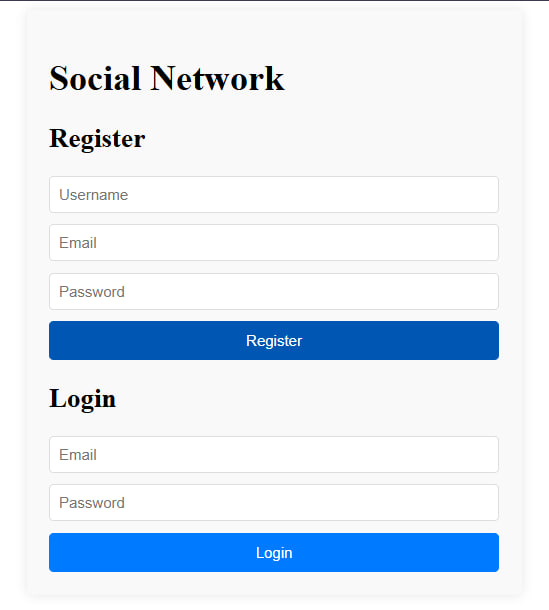
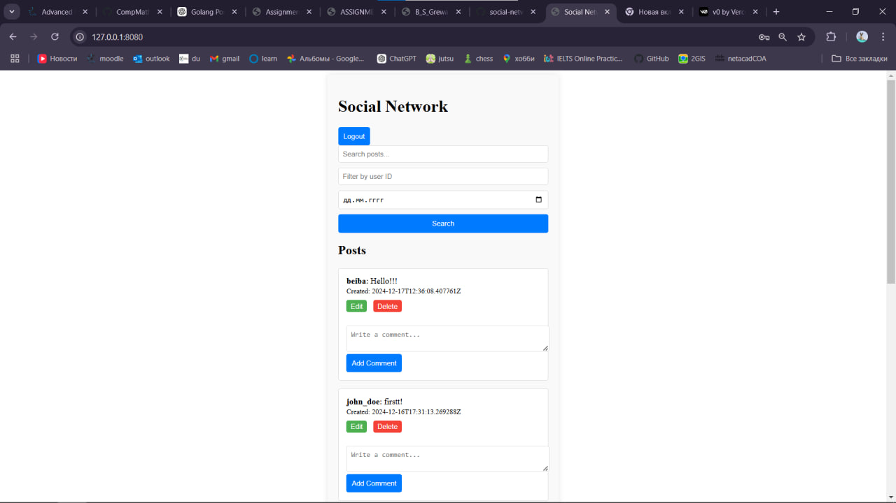
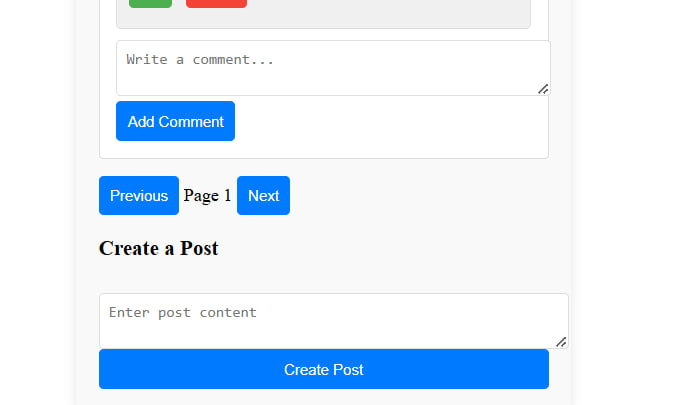

# Social Network Platform

## Overview
The Social Network Platform is a robust web application designed for user interaction through posts, comments, and discussions. This project showcases advanced CRUD operations, user authentication, and additional features like search, pagination, and filtering to enhance user experience and engagement.

## Live Demo
Experience the platform live at: [https://social-network-2.onrender.com/](https://social-network-2.onrender.com/)

## Features
1. **User Management:**
   - User registration with email verification
   - Secure login and authentication
   - Profile management (edit profile, change password)
   - User roles (regular user, admin)

2. **Posts and Comments:**
   - Create, read, update, and delete posts and comments
   - Rich text editor for post creation
   - Like and unlike posts
   - Add comments to posts, including nested comments

3. **Advanced Functionality:**
   - **Search:** Find posts and users by keywords
   - **Pagination:** Navigate through posts or comments efficiently
   - **Filtering:** Filter posts by user, date range, or popularity
   - **Real-time Updates:** Instant notifications for new posts and comments

4. **Admin Features:**
   - User management (ban/unban users)
   - Content moderation (remove inappropriate posts/comments)
   - Analytics dashboard

5. **Security:**
   - JWT-based authentication
   - Password hashing
   - CSRF protection
   - Rate limiting to prevent abuse

## Technologies Used
- **Backend:** Go (Golang)
- **Frontend:** HTML, CSS, JavaScript
- **Database:** PostgreSQL
- **ORM:** GORM
- **Authentication:** JWT
- **Testing:** Go testing package, Postman
- **Deployment:** Render

## Screenshots




## Local Development Setup

### Prerequisites
1. Go (1.16+): [Download Go](https://golang.org/dl/)
2. PostgreSQL: [Download PostgreSQL](https://www.postgresql.org/download/)
3. Git: [Download Git](https://git-scm.com/downloads)

### Setup Steps
1. Clone the repository:
   ```bash
   git clone https://github.com/pinokiochan/social-network.git
   cd social-network
   
2. Set up the database:

- Create a new PostgreSQL database named `social-network`
- Update the database connection string in `config/config.go`:
   ```bash
   connStr := "host=localhost port=5432 user=your_username password=your_password dbname=social-network sslmode=disable"
   ```
3. Install dependencies:
```bash
go mod tidy
```
4. Run database migrations:
```bash 
go run cmd/migrate/main.go
```
5.Start the server:
```bash 
go run cmd/main.go
```
6. Access the application at `http://localhost:8080`

## Deployment

The application is currently deployed on Render. For deployment instructions, refer to the [Render documentation](https://render.com/docs).

## Contributing

Contributions are welcome! Please feel free to submit a Pull Request.

## License

This project is licensed under the MIT License - see the [LICENSE](LICENSE) file for details.

## Acknowledgements

- [Gorilla Mux](https://github.com/gorilla/mux) for routing
- [GORM](https://gorm.io/) for ORM
- [JWT-Go](https://github.com/dgrijalva/jwt-go) for JWT authentication
- [Render](https://render.com/) for hosting


## Contact

For any queries or suggestions, please contact:

- Beibars Yergali - [GitHub](https://github.com/pinokiochan)